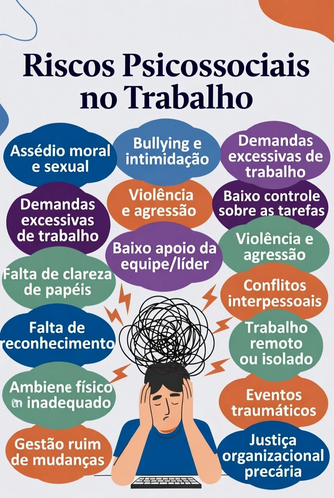

# Inteligência Artificial e Riscos Psicossociais no Trabalho — NotebookLM + RAG

## Objetivo

Este projeto explora o uso do NotebookLM como ferramenta de aprendizagem ativa aplicada ao estudo de riscos psicossociais no trabalho, saúde mental ocupacional e inteligência artificial generativa.

O objetivo principal foi investigar como arquiteturas baseadas em IA e técnicas de RAG (Retrieval-Augmented Generation) podem auxiliar:
- na curadoria de fontes;
- na organização do conhecimento;
- na síntese temática;
- na construção de resumos estruturados;
- e na formulação de prompts reutilizáveis para estudos futuros.

---

## Problema Investigado

Os riscos psicossociais vêm se tornando um tema central nas discussões sobre saúde mental ocupacional, especialmente diante do aumento de casos relacionados a:
- burnout;
- estresse ocupacional;
- sobrecarga de trabalho;
- assédio moral;
- pressão por produtividade;
- insegurança psicológica;
- e transformação digital das relações de trabalho.

Neste contexto, o projeto buscou analisar como ferramentas de IA generativa podem apoiar processos de aprendizagem ativa e organização do conhecimento em temas complexos relacionados à NR-1, saúde mental e riscos ocupacionais.

---

## Curadoria de Fontes

As principais fontes utilizadas no NotebookLM foram:

### Documentos Técnicos e Normativos

1. NR-1 — Norma Regulamentadora nº 1  
https://www.gov.br/trabalho-e-emprego/pt-br/acesso-a-informacao/participacao-social/conselhos-e-orgaos-colegiados/comissao-tripartite-partitaria-permanente/normas-regulamentadora/normas-regulamentadoras-vigentes/nr-01-atualizada-2025-i-1.pdf

2. WHO — Mental Health at Work  
https://www.who.int/news-room/fact-sheets/detail/mental-health-at-work

3. ILO — Psychosocial Risks and Mental Health  
https://www.ilo.org/global/topics/safety-and-health-at-work/resources-library/publications/WCMS_108557/lang--en/index.htm

4. Materiais sobre IA Generativa e RAG

5. Artigos relacionados à saúde mental ocupacional e cultura organizacional

---

## Fontes Multimídia Complementares

Além das fontes técnicas e normativas, também foram utilizados vídeos relacionados à saúde mental ocupacional, riscos psicossociais, IA generativa e impactos organizacionais da transformação digital.

### NR-1 e riscos psicossociais

- CANPAT 2024 — Alterações da NR-1 e Riscos Psicossociais  
https://www.youtube.com/watch?v=Z9Al3KoES-k

- NR-1 e gerenciamento de riscos psicossociais  
https://www.youtube.com/watch?v=S3ZKt6teXLM

- Riscos Psicossociais no Trabalho — O que as empresas devem fazer  
https://www.youtube.com/watch?v=UoNBlxsUDr4

- Nova NR-1 e saúde mental no ambiente organizacional  
https://www.youtube.com/watch?v=JSRwuy1o5x8

---

### Saúde mental ocupacional

- Saúde Mental Relacionada ao Trabalho — Aspectos Psicossociais  
https://www.youtube.com/watch?v=ZGqFVrtejjc

- Fatores de riscos psicossociais e saúde mental no trabalho  
https://www.youtube.com/watch?v=Ld0uM6t_QRU

- Burnout e adoecimento ocupacional no ambiente corporativo  
https://www.youtube.com/watch?v=8vtt7Z0xF2A

- Psicodinâmica do Trabalho e sofrimento psíquico  
https://www.youtube.com/watch?v=J8I7lA2k5Ko

---

### Inteligência Artificial e impactos no trabalho

- Inteligência Artificial, produtividade e saúde mental  
https://www.youtube.com/watch?v=7k6wM8eN4H8

- IA generativa e transformação das relações de trabalho  
https://www.youtube.com/watch?v=3f4J8x7mJ7Y

- O impacto da IA no futuro do trabalho  
https://www.youtube.com/watch?v=6Af6b_wyiwI

- IA, automação e pressão por produtividade nas organizações  
https://www.youtube.com/watch?v=9nNta8WBBTo

---

## Ferramentas Utilizadas

- NotebookLM
- GitHub
- Inteligência Artificial Generativa
- RAG (Retrieval-Augmented Generation)
- Engenharia de Prompts

---

## Engenharia de Prompts

### Prompt 1
Explique os principais riscos psicossociais relacionados ao ambiente de trabalho e seus possíveis impactos na saúde mental dos trabalhadores.

### Prompt 2
Crie um resumo estruturado relacionando NR-1, gerenciamento de riscos ocupacionais e saúde mental no trabalho.

### Prompt 3
Compare burnout, estresse ocupacional e assédio moral com base nas fontes utilizadas.

### Prompt 4
Explique como arquiteturas RAG podem melhorar a contextualização das respostas produzidas por sistemas de IA generativa.

### Prompt 5
Quais limitações existem no uso de IA generativa para interpretação de normas e temas relacionados à saúde mental ocupacional?

---

## Dificuldades Encontradas ("Cicatrizes")

Durante o desenvolvimento do projeto, algumas limitações foram observadas:

- respostas excessivamente genéricas;
- dificuldade da IA em contextualizar normas brasileiras;
- necessidade de refinamento iterativo dos prompts;
- risco de alucinação em interpretações normativas;
- dependência da qualidade das fontes inseridas no NotebookLM;
- simplificação excessiva de temas complexos relacionados ao sofrimento humano e relações de trabalho.

Os melhores resultados ocorreram quando os prompts passaram a solicitar:
- respostas estruturadas;
- comparações entre conceitos;
- exemplos práticos;
- contextualização normativa;
- e síntese acadêmica mais detalhada.

---

## Glossário

| Conceito | Definição |
|---|---|
| Riscos Psicossociais | Fatores organizacionais que podem gerar sofrimento mental ou físico |
| Burnout | Síndrome relacionada ao esgotamento ocupacional crônico |
| GRO | Gerenciamento de Riscos Ocupacionais |
| PGR | Programa de Gerenciamento de Riscos |
| RAG | Técnica que combina recuperação de informação e geração de texto |
| NotebookLM | Ferramenta de IA voltada para organização e análise de documentos |
| IA Generativa | Sistemas capazes de produzir texto, síntese e respostas contextualizadas |
| Saúde Mental Ocupacional | Área relacionada ao bem-estar psicológico no ambiente de trabalho |

---

## Observação Técnica

A qualidade das respostas produzidas pelo NotebookLM mostrou forte dependência:
- da qualidade das fontes inseridas;
- da especificidade dos prompts;
- da diversidade temática dos documentos utilizados;
- e da capacidade de curadoria humana sobre os materiais utilizados.

Isso reforça a importância da validação crítica em sistemas baseados em IA generativa e arquiteturas RAG.

---

## Conclusão

O projeto demonstrou que ferramentas de IA generativa, como o NotebookLM, podem atuar como mecanismos de aprendizagem ativa, auxiliando na curadoria de fontes, síntese do conhecimento e organização temática de conteúdos complexos.

Além dos benefícios observados, também foram identificadas limitações relacionadas à interpretação contextual e à necessidade de validação crítica humana, especialmente em temas ligados à saúde mental e riscos psicossociais.

A utilização de técnicas baseadas em RAG mostrou potencial para reduzir respostas superficiais e melhorar a contextualização das informações produzidas pela IA.
